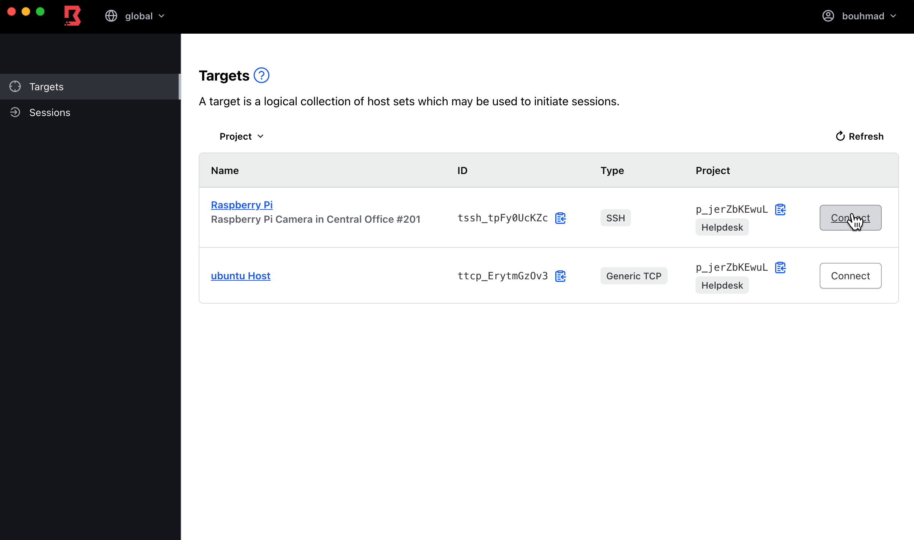

# Boundary

- What is Boundary: https://developer.hashicorp.com/boundary/docs/overview/what-is-boundary
- Website: https://www.boundaryproject.io/
- Forums: [HashiCorp Discuss](https://discuss.hashicorp.com/c/boundary/)
- Documentation: [https://boundaryproject.io/docs](https://boundaryproject.io/docs)
- Tutorials: [HashiCorp's Learn Platform](https://developer.hashicorp.com/boundary/tutorials)


Boundary provides a simple and secure way to access hosts and critical systems without the need to handle credentials, set up firewalls, or expose your network.

With Boundary you can:

* Enable single sign-on to target services and applications via external identity providers
* Provide Just-in-Time network access to resources, wherever they reside 
* Enable passwordless access to machines with dynamic credentials via [HashiCorp Vault](https://www.vaultproject.io/)
* Automate discovery of new target systems
* Record and manage privileged sessions
* Standardize your team's access workflow with a consistent experience for any type of infrastructure across any provider


Boundary is designed to be straightforward to understand, highly scalable, and 
resilient. It can run in clouds, on-prem, secure enclaves and more, and does not require
an agent to be installed on every end host.


<a href="https://www.youtube.com/watch?v=DCkDqZdATC0">
  
</a>


## Getting started

Boundary consists of two server components: 

* **Controller**, which serve the API and coordinate session requests
* **Workers**, which perform session handling

A real-world Boundary installation will likely consist of one or more
controllers paired with one or more workers. A single Boundary binary can act
in either of these two modes.

Additionally, Boundary provides a Desktop client and CLI for end-users to request and establish 
authorized sessions to resources across a network.




Boundary does _not_ require software to be installed on your hosts and services.

## Requirements

Boundary has two external dependencies: 
- A SQL database
- At least one KMS

### SQL database
The database contains Boundary's configuration and session information. The 
database must be accessible by Controller nodes. 

Values that are secrets (e.g credentials) are encrypted in the database. Currently, PostgreSQL is supported as a database and has been tested with Postgres 12 and above.

Boundary uses only common extensions and both hosted and self-managed instances are supported.
In most instances all that is needed is a database endpoint and appropriate credentials.

### KMS 
Currently, two keys within the KMS are required: one for
authenticating other cluster components, which must be accessible by both
controllers and workers; and one for encrypting secret values in the database,
which only needs to be accessible to controllers. You can change these keys over
time,
and Boundary uses key derivation extensively to avoid key sprawl of these high-value
keys. If other keys are available, you can use them for other purposes, such as
recovery functionality and encryption of sensitive values in Boundary's config
file.

You can use any cloud KMS or Vault's Transit Secrets Engine to satisfy the KMS
requirement. 

## Trying out Boundary

Running Boundary in a more permanent context requires a few more steps, such
as writing some simple configuration files to tell the nodes how to reach their
database and KMS. The steps below, along with the extra information needed
for permanent installations, are detailed in our [Installation Guide](https://developer.hashicorp.com/boundary/docs/install-boundary/install).

> ⚠️  Do _not_ use the `main` branch except for dev or test cases. Boundary 0.10 introduced release branches which should be safe to track, however, migrations in `main` may be renumbered if needed. The Boundary team will not be able to provide assistance if running `main` over the long term results in migration breakages.

## Quickstart with Boundary Dev

Boundary has a `dev` mode that you can use for testing. In this mode both a
controller and worker are started with a single command, and they have the
following properties:

* The controller starts a PostgreSQL Docker container to use as storage.
  This container will be shut down and removed, if possible, when the
  controller is shut down gracefully.
* The controller will use an internal KMS with ephemeral keys

If you have the following requirements met locally, you can get up and running with Boundary quickly:
- Go v1.21 or greater
- Docker
- Either the [Boundary UI Dependencies](https://github.com/hashicorp/boundary-ui#prerequisites)
  for locally building the ui assets
  or [gh cli](https://cli.github.com) for downloading pre-built ui assets.

Simply run:

  ```make install```

This will build Boundary. (The first time this is run it will fetch and compile
UI assets; which will take a few extra minutes.) Once complete, run Boundary in
`dev` mode:

  ```$GOPATH/bin/boundary dev```

Please note that development may require other tools; to install the set of
tools at the versions used by the Boundary team, run:

  ```make tools```

Without doing so, you may encounter errors while running `make install`. It is important
to also note that using `make tools` will install various tools used for Boundary
development to the normal Go binary directory; this may overwrite or take precedence
over tools that might already be installed on the system.

### Download and Run from Release Page

Download the latest release of the server binary and appropriate desktop
client(s) from our [releases page](https://releases.hashicorp.com/boundary/)

### Start Boundary

Start the server binary with:

  ```boundary dev```

This will start a Controller service listening on `http://127.0.0.1:9200` for
incoming API requests and a Worker service listening on `http://127.0.0.1:9202`
for incoming session requests. It will also create various default resources and
display various useful pieces of information, such as a login name and password
that can be used to authenticate.

### Configuring Resources

For a simple test of Boundary in `dev` mode you don't generally need to
configure any resources at all! But it's useful to understand what `dev` mode
did for you so you can then take further steps. By default, `dev` mode will
create:

* The `global` Scope for initial authentication, containing a Password-type
  Auth Method, along with an Account for login.
* An organization Scope under `global`, and a project Scope inside the
  organization.
* A Host Catalog with a default Host Set, which itself contains a Host with the
  address of the local machine (`127.0.0.1`)
* A Target mapping the Host Set to a set of connection parameters, with a
  default port of `22` (e.g. SSH)

You can go into Boundary's web UI or use its API to change these
default values, for instance if you want to connect to a different host or need
to modify the port on which to to connect.

### Making the Connection

Next, let's actually make a connection to your local SSH daemon via Boundary:

1. Authenticate to Boundary; using default `dev` values, this would be `boundary
   authenticate password -auth-method-id ampw_1234567890 -login-name admin
   -password password`. (Note that if you do not include the `password` flag you
   will be prompted for it.)
2. Run `boundary connect ssh -target-id ttcp_1234567890`. If you want to adjust
   the username, pass `-username <name>` to the command.

Check out the possibilities for target configuration to test out limiting (or increasing) the
number of connections per session or setting a maximum time limit; try canceling
an active session from the sessions page or via `boundary sessions`, make your
own commands with `boundary connect -exec`, and so on.

### Going Further

This example is a simple way to get started but omits several key steps that
could be taken in a production context:

* Using a firewall or other means to restrict the set of hosts allowed to
  connect to a local service to only Boundary Worker nodes, thereby making
  Boundary the _only_ means of ingress to a host
* Using the [Boundary Terraform provider](https://registry.terraform.io/providers/hashicorp/boundary/latest) to easily integrate Boundary with your
  existing code-based infrastructure
* Pointing a BI tool (PowerBI, Tableau, etc.) at Boundary's data warehouse to
  generate insights and look for anomalies with respect to session access

There are many, many more things that Boundary will do in the future in terms of
integrations, features, and more. We have a long roadmap planned out, so stay
tuned for information about new features and capabilities!

----

**Please note**: We take Boundary's security and our users' trust very
seriously. If you believe you have found a security issue in Boundary,
_please responsibly disclose_ by contacting us at
[security@hashicorp.com](mailto:security@hashicorp.com).

----

## Contributing

Thank you for your interest in contributing! Please refer to
[CONTRIBUTING.md](https://github.com/hashicorp/boundary/blob/main/CONTRIBUTING.md) for guidance.
