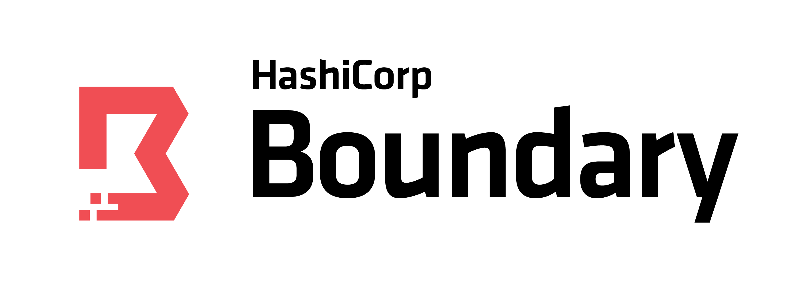

Boundary Community Edition (CE) is no longer under active development, and this repository has been archived as of October 8, 2026. Future Boundary development will focus on HCP Boundary and Boundary Enterprise, where we can provide enterprise grade human and agentic access capabilities.

This repository is now read-only and no longer accepts new issues, pull requests, or community contributions. Existing source code and previously released binaries remain available for reference and existing self-managed use.

No new Boundary CE releases, maintenance updates, bug fixes, or security patches are currently planned.

Teams continuing to use Boundary CE should evaluate whether it meets their operational, security, and compliance requirements.
For supported Boundary capabilities, including production-scale governance, compliance, session recording, enterprise support, and future Boundary development, please evaluate HCP Boundary or Boundary Enterprise.
