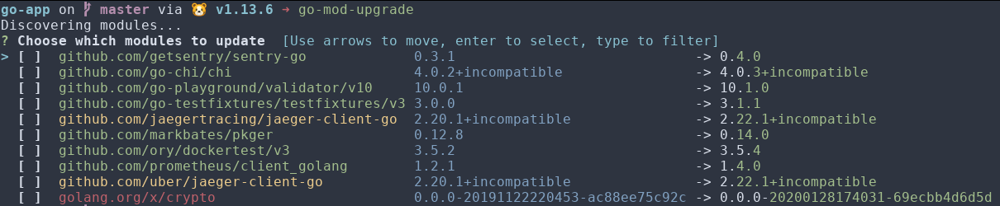

# go-mod-upgrade

[](https://travis-ci.com/oligot/go-mod-upgrade)
[](/license)
[](https://github.com/oligot/go-mod-upgrade/releases/latest)

> Update outdated Go dependencies interactively 



Note that only patch and minor updates are supported for now.

## Why

The Go wiki has a great section on [How to Upgrade and Downgrade Dependencies](https://go.dev/wiki/Modules#how-to-upgrade-and-downgrade-dependencies).
One can run the command
```bash
go list -u -f '{{if (and (not (or .Main .Indirect)) .Update)}}{{.Path}}: {{.Version}} -> {{.Update.Version}}{{end}}' -m all 2> /dev/null
```
to view available upgrades for direct dependencies.
Unfortunately, the output is not actionable, i.e. we can't easily use it to update multiple dependencies.

This tool is an attempt to make it easier to update multiple dependencies interactively.
This is similar to [yarn upgrade-interactive](https://legacy.yarnpkg.com/en/docs/cli/upgrade-interactive/), but for Go.

## Install

Pre-compiled binaries for Windows, OS X and Linux are available in the [releases page](https://github.com/oligot/go-mod-upgrade/releases).

Alternatively, with the Go toolchain, you can do

```
go install github.com/oligot/go-mod-upgrade@latest
```

## Usage

In a Go project which uses modules, you can now run
```
go-mod-upgrade
```

Colors in module names help identify the update type:
* green for a minor update
* yellow for a patch update
* red for a prerelease update

Additional options can be specified via the CLI global options:

``` 
GLOBAL OPTIONS:
   --pagesize value, -p value  Specify page size (default: 10)
   --force, -f                 Force update all modules in non-interactive mode (default: false)
   --verbose, -v               Verbose mode (default: false)
   --hook value                Hook to execute for each updated module
   --ignore value, -i value    Ignore modules matching the given regular expression
   --help, -h                  show help (default: false)
   --version                   print the version (default: false)
```
